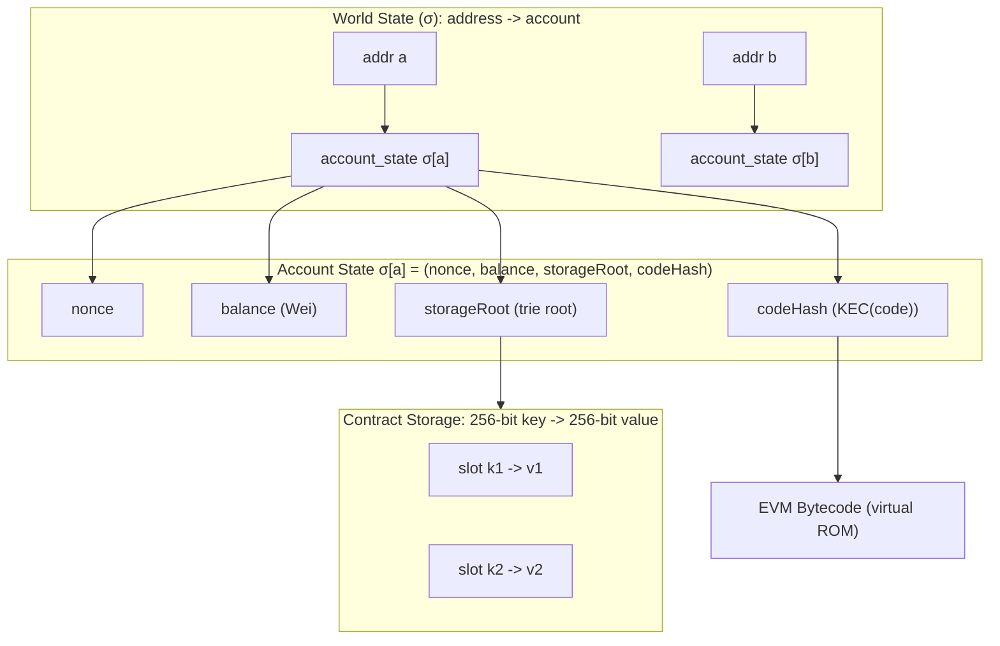
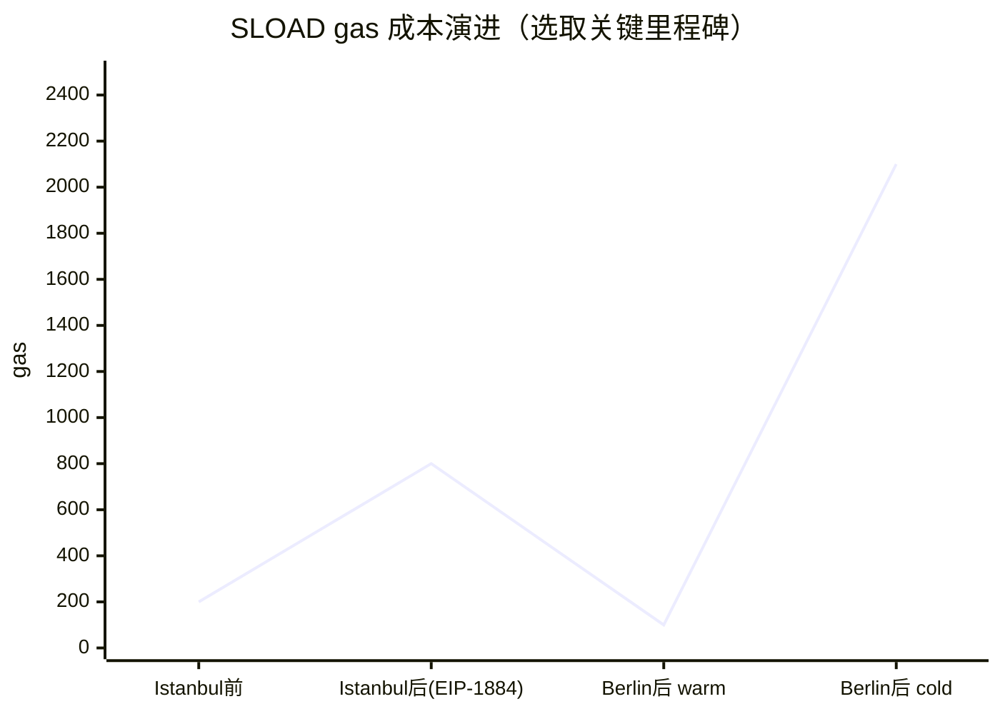
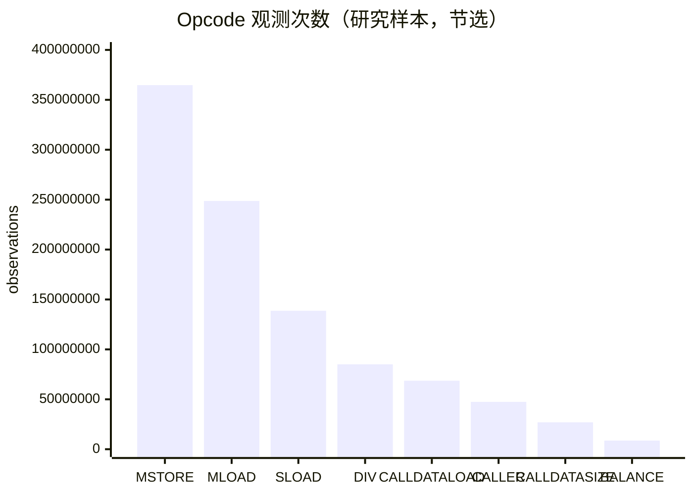
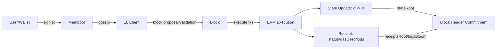

# 以太坊虚拟机 EVM 深度研究报告

## 执行摘要

从entity["organization","以太坊基金会","nonprofit protocol steward"]成员的视角，EVM 的定位不仅是“智能合约的运行时”，更是entity["organization","以太坊","blockchain network"]执行层（Execution Layer）状态机的核心：它在所有节点上以确定性方式执行字节码，驱动“交易 → 状态转换 → 新状态根”的共识可验证过程，并通过 gas 将计算/状态访问成本显式化，以抵御 DoS、约束资源并形成费用市场。citeturn27search17turn11view1

EVM 的关键工程现实在于：它的抽象（256-bit 栈机、可扩展内存、持久化存储、账户/世界状态）与底层状态数据库（如 Merkle Patricia Trie 及其客户端实现）强耦合。世界状态是“地址 → 账户状态”的映射，账户状态由 nonce、balance、storageRoot、codeHash 四要素构成，客户端需在可证明的数据结构中维护该映射并将根哈希提交到区块链头部。citeturn9view0turn11view1

过去十年里，“gas 定价与可预测性”是 EVM 演进的主线之一：Istanbul/ Berlin/ London/ Shanghai/ Dencun/ Pectra/ Fusaka 等升级，反复围绕状态访问成本（SLOAD/BALANCE/EXT* 等）和交易数据成本（calldata、initcode、blob）调整规则；同时通过 access list、冷热访问（cold/warm）、refund 限制、initcode 计量、以及对“数据密集型交易”的 calldata 价格下限等机制，让 worst-case 资源消耗更可控。citeturn2search0turn0search3turn3search1turn17view3turn20search6turn24view0turn25view0

在实现生态方面，主流执行客户端（geth、Nethermind、Erigon、Besu）持续跟进主网升级，围绕同步模式、状态裁剪、存储格式、追踪/调试接口形成差异化；而 OpenEthereum 已归档停更，代表了历史路径但不再适用于主网最新规则。citeturn13search0turn13search1turn13search2turn13search3turn14search2turn14search12

形式化与可验证性是 EF 长期投入方向：从黄皮书形式化定义，到可执行规范（execution-specs / EELS）、到 KEVM（K Framework 可执行语义）、Isabelle/HOL 与 F* 等多套语义与程序逻辑工作，使得“字节码级别正确性/等价性验证、差分测试、符号执行”逐步工程化。citeturn11view1turn16search3turn16search11turn16search14turn16search1turn16search36

面向 2026 及之后的开放问题集中在：状态增长与 I/O 不确定性导致的经济与去中心化压力（gas 定价失配）、更强的状态访问显式化与证明友好执行（如 Verkle/“无状态性”相关提案）、字节码结构化（EOF）与静态可分析性、以及长期“是否替换 EVM（eWASM、RISC‑V 等）”的路线权衡。citeturn28view4turn23search21turn4search3turn15search0turn26search15

## EVM 架构与世界状态

**简要解释**：EVM 是一个确定性的、栈式（stack-based）虚拟机。它并不“自带世界”，而是运行在以太坊执行环境（包含世界状态、区块头字段、交易上下文）之上；每次执行据此产生状态变更、日志与回执，并最终影响区块头的状态根。citeturn11view1turn27search17

**技术细节：世界状态与账户模型**  
黄皮书将世界状态（world state）定义为“地址（160-bit 标识符）到账户状态”的映射，并假定客户端用修改版 Merkle Patricia tree 维护该映射；账户状态由四个字段构成：nonce、balance、storageRoot、codeHash。citeturn9view0  
这四元组的重要含义是：

- **nonce**：EOA 的外发交易计数；合约账户则用于合约创建计数等。citeturn9view0  
- **balance**：以 Wei 计价的余额。citeturn9view0  
- **storageRoot**：该账户存储（storage）内容的 trie 根哈希，存储键和值都是 256-bit。citeturn9view0  
- **codeHash**：与该账户关联的 EVM code 的哈希（代码本体存于状态数据库的其他位置，按哈希索引）。citeturn9view0turn11view1  

**技术细节：EVM 组件（栈、内存、存储、代码、环境）**  
黄皮书的执行模型明确：EVM 是简单的栈架构，机器字长 256-bit；内存是“按 word 寻址的 byte array”（可扩展、易失）；栈最大深度 1024；存储与内存类似但为“word 寻址的 word array”，并且是非易失、属于系统状态的一部分；代码不采用冯·诺依曼式的可写内存模型，而是存放在独立的“虚拟 ROM”中，只能通过特定指令交互。citeturn11view1  
执行环境还包括一组必备上下文字段（如代码所属地址、原始交易发起者、输入数据、区块头等），黄皮书以元组 I 列出这些元素并用于定义执行函数 Ξ。citeturn11view1turn11view0

**示例：Solidity 存储槽位（storage slot）如何映射到 EVM storage**  
对开发者最关键的“EVM ↔ 高级语言”接口之一，是编译器如何把结构化数据映射到 256-bit 存储槽。Solidity 文档对 mapping / array 的槽位规则给出经典公式：例如 mapping 中 key 为 k、基槽为 p，则元素位置为 `keccak256(k . p)`（拼接后哈希），动态数组的数据区域在 `keccak256(p)` 起始。citeturn8search21  
这解释了为什么 storage 访问往往伴随 keccak 计算、为何“槽位布局”是可组合但不直观的工程约束。

**实际影响**  
世界状态是全网节点必须长期维护的共享数据库，storage 的每一次扩张都对全网施加长期成本；因此 EVM 的 gas 设计天然倾向“把持久化状态变更变贵”，以经济手段抑制状态爆炸。黄皮书也明确指出清除存储会产生（受条件约束的）退款以激励减少状态占用。citeturn16search2turn11view1  

**EVM 状态模型示意图（mermaid）**



citeturn9view0turn11view1

## 指令集、ABI 与编译管线

**简要解释**：EVM 的最小可移植接口由三层组成：  
1）**opcode 指令集**（字节码语义）；2）**ABI**（调用数据/返回数据/事件日志编码约定）；3）**编译与字节码封装格式**（Solidity/Vyper → initcode/runtime → 元数据）。这些层共同决定“合约如何被部署、如何被调用、如何被工具理解”。citeturn27search4turn8search1turn9view1turn7search37

**技术细节：opcode 列表与语义表述方式**  
以太坊开发者文档提供“EVM opcode 列表”作为入口索引。citeturn27search4  
黄皮书在附录中用更形式化的方式给出每条指令的：字节值（Value）、助记符（Mnemonic）、入栈/出栈数（δ/α）、以及对机器状态（栈、内存、存储、PC、gas）的转移规则；例如 `SLOAD`/`SSTORE`、`JUMP`/`JUMPI`、`PUSH0`/`PUSH1..32` 等指令都以统一表格描述。citeturn12view0turn12view1turn11view1turn17view2  

为了在报告中“可读地覆盖全量指令”，建议将 opcode 分为若干类，并把“全表”作为权威索引引用（而不是在正文逐字重复）：

- **算术与位运算**：ADD/MUL/SUB/DIV、SHL/SHR、LT/GT/EQ、AND/OR/XOR、KECCAK256（SHA3）等。citeturn27search4turn12view0  
- **环境与区块上下文**：ADDRESS、CALLER、ORIGIN、COINBASE、BASEFEE、BLOBBASEFEE 等。citeturn27search4turn19search0turn19search1  
- **内存/存储**：MLOAD/MSTORE/MSTORE8/MCOPY、SLOAD/SSTORE、（Dencun 后）TLOAD/TSTORE。citeturn12view0turn17view1turn18view3  
- **控制流**：JUMP/JUMPI/JUMPDEST/PC。citeturn12view0turn12view1  
- **系统与消息调用**：CALL/DELEGATECALL/STATICCALL、CREATE/CREATE2、RETURN/REVERT、SELFDESTRUCT（语义已在 Shanghai/Dencun 后发生重要收敛）。citeturn11view1turn3search3  

**代表性指令语义与示例**  
下面用少量代表性例子展示“栈机 + 内存/存储 + 调用”的编程模型。

示例一：`PUSH0`（零常量入栈）  
EIP-3855 定义 `PUSH0` 位于 `0x5f`，不读取立即数、不弹栈，向栈压入一个值 0，gas 成本为 2。citeturn17view2  

示例字节码（伪）：  
- `0x5f 0x5f 0x01` 表示：push0, push0, add（将 0+0）。  
编译器层面，`PUSH0` 降低了“生成 0 常量”的字节码长度与执行成本（尤其是大量零初始化/清槽位场景）。citeturn17view2turn12view1

示例二：`SLOAD`/`SSTORE`（持久化状态读写）  
黄皮书在 opcode 表中专门给出 `SLOAD`/`SSTORE` 的状态转移公式，并将其 gas 成本与“冷热访问”和 EIP-2200 的 SSTORE 计费逻辑关联。citeturn12view0turn11view1turn3search2turn0search3  
工程含义：storage 访问是协议层最敏感的成本来源之一，gas 规则在多个硬分叉中被反复调整以反映状态 trie/I-O 成本。citeturn2search0turn0search3turn28view4  

示例三：`MCOPY`（内存拷贝原语）  
EIP-5656 引入 `MCOPY`，语义为把 memory 中 `[src, src+len)` 拷贝到 `[dst, dst+len)`，并规定“允许重叠，行为等价于使用中间缓冲区”；gas 成本按黄皮书 `W_copy` 组计算：`Gverylow + Gcopy * ceil(len/32) + memory_expansion_cost`。citeturn17view1turn11view1  
这为编译器/库实现内存搬运提供更直接的 IR 目标，减少依赖 identity 预编译等间接方案。citeturn17view1

**技术细节：ABI 与调用约定**  
Solidity 的 ABI 规范定义了合约外部接口的编码方式：函数调用的 calldata 以 4 字节 selector（函数签名 keccak256 的前 4 字节）开头，后续按类型规则编码参数；事件（event）则把 event signature hash 与 indexed 参数放入 topics，未 indexed 的参数 ABI 编码进入 data。citeturn8search1turn8search5  
这套约定的实际价值是“语言无关”：不同语言/工具只要遵守 ABI，就能互操作调用合约。

代表性例子（calldata 结构示意）：

```text
calldata = 0x
  [0..3]   function_selector
  [4..]    abi_encode(arg1, arg2, ...)
```

事件日志（log）结构要点：topics 数量受限（非 anonymous event 最多 3 个 indexed 参数 + topic0 为签名；anonymous event 可不同），topic 是 32 字节 word，引用类型 indexed 时会存 keccak256(value) 而非原值。citeturn8search1turn8search5

**技术细节：字节码形态、initcode/runtime 与编译管线**  
黄皮书区分合约创建交易中的两段代码：`init`（初始化代码）与 `body`（运行时代码）。init 在创建时执行一次，并“返回 body”；之后账户只保留 body 作为常驻代码。citeturn9view1  
这直接解释了为什么“构造函数逻辑”不会出现在 runtime bytecode 中（它属于 initcode 的副作用），以及为什么部署交易常更大、成本更高。

Solidity 编译器 solc 推荐使用标准 JSON 接口，输出中区分 `bytecode`（部署/创建代码相关输出）与 `deployedBytecode`（链上运行时代码相关输出），并支持输出 source map、gas 估计等信息。citeturn7search37  
Solidity 还会在产物字节码中包含/引用元数据（metadata hash），且元数据变化会导致字节码变化，进而影响链上验证与可重复构建。citeturn7search13turn7search37  

Vyper 亦可输出 deployable bytecode 与 runtime bytecode（bytecode_runtime），以及 ABI、source_map、IR 等编译产物。citeturn7search16turn7search0  

**实际影响：代码大小与格式演进（EOF）**  
EIP-170 为合约代码大小设定上限（24,576 bytes），以降低在固定 gas 下反复加载巨大代码导致的 DoS 风险。citeturn8search0  
以太坊开发者文档也提示超过该限制会导致主网不可部署，并建议通过优化器、库、代理等手段缩减体积。citeturn7search15  
随后 EIP-3860 又引入 initcode 长度上限与按 word 计量的 initcode 成本（MAX_INITCODE_SIZE = 2 * MAX_CODE_SIZE，INITCODE_WORD_COST = 2），把“部署阶段的字节码体积”也纳入显式计费。citeturn17view3turn8search0  

在更长期的“字节码结构化”方向上，EIP-3540 提出 EOF（EVM Object Format）的版本化封装；而 EIP-3541 先行拒绝新合约以 `0xEF` 开头，以为 EOF 预留前缀空间。citeturn4search3turn8search3  
EOF 的战略目标是降低动态跳转、代码解析与静态分析难度，为更强的验证、优化与执行效率铺路（但其上线节奏与批次取决于网络升级范围与实现成熟度）。citeturn4search3turn8search3turn23search6  

## Gas 模型与成本演进

**简要解释**：gas 是 EVM 的资源计量单位，也是执行层费用市场的结算基底。其核心作用有三：  
1）**为每个 opcode/资源访问定价**（防 DoS）；2）**将执行成本外部化**（用户付费）；3）**提供协议升级时的调参旋钮**（通过 repricing 适配硬件与状态增长）。citeturn11view1turn3search0turn28view0

**技术细节：gas 由哪些部分构成**  
从黄皮书执行模型与后续 EIP 的公式可以把一次交易的 gas 消耗拆成：

- **固定开销**：基础交易成本（常见为 21,000）。citeturn21view0  
- **数据开销**：calldata 依零字节/非零字节计费；Pectra 的 EIP-7623 引入“按 token 计”的地板价机制，尤其限制“主要用于发布数据”的交易进入区块时的最坏体积。citeturn21view0turn24view0  
- **执行开销**：EVM 执行每条指令的固有成本 + 动态成本（内存扩张、复制、状态访问冷热等）。citeturn11view1turn0search3turn17view1  
- **创建开销**：合约创建除执行 gas 外还有额外项（例如 creation 固有成本、initcode 成本与上限）。citeturn17view3turn21view0turn9view1  
- **退款（refund）**：历史上通过“清除存储”等行为给予退款激励，但 London 的 EIP-3529 明确削弱退款强度并限制 refund 滥用空间。citeturn16search2turn3search1  

黄皮书还指出内存扩张按“用到的最小 32 字节倍数范围”计费，采取按需（just-in-time）支付方式；因此访问更高地址会产生额外内存费用，并使极大内存变得昂贵。citeturn11view1

**技术细节：冷热访问（EIP-2929）与 access list（EIP-2930）**  
Berlin 的 EIP-2929 引入 accessed_addresses / accessed_storage_keys 的全局集合，将首次访问标记为“cold”，后续为“warm”。其关键常量包括：  
- `COLD_SLOAD_COST = 2100`  
- `WARM_STORAGE_READ_COST = 100`  
- `COLD_ACCOUNT_ACCESS_COST = 2600`  
并据此重定价 SLOAD 与多类账户相关指令。citeturn0search3  

EIP-2930 进一步引入“带 access list 的交易类型”，允许交易声明计划访问的地址与存储键，从而提前“预热”并获得折扣，降低合约因 gas repricing 而被“卡死”的风险，同时也为未来更广泛的静态访问模式奠基。citeturn20search1turn0search3  
不过实证研究显示 access list 的采用率长期偏低：对一个月主网交易的分析发现仅约 1.46% 交易包含 access list，尽管相当比例的交易可能从中获益。citeturn20search18  

**技术细节：initcode 计量（EIP-3860）**  
Shanghai 的 EIP-3860 将 initcode 的长度上限与成本纳入交易 intrinsic gas，参数包括：  
- `INITCODE_WORD_COST = 2`  
- `MAX_INITCODE_SIZE = 2 * MAX_CODE_SIZE`，其中 `MAX_CODE_SIZE` 由 EIP-170 定义为 24576  
并要求 create tx / CREATE(2) 都对 initcode 额外计费与限长。citeturn17view3turn8search0  

**技术细节：Dencun 与 Pectra/Fusaka 的“数据成本再平衡”**  
Dencun 激活 EIP-4844（blob 交易，EVM 不可直接访问 blob 内容但可访问承诺/版本哈希），以更低成本为 rollup 提供临时 DA 通道，从而显著降低 L2 发布数据成本。citeturn20search6turn20search0  
同时 Dencun 还引入/调整多条执行层指令：EIP-1153（TLOAD/TSTORE）、EIP-5656（MCOPY）、EIP-7516（BLOBBASEFEE）、EIP-6780（SELFDESTRUCT 语义收敛）等。citeturn18view3turn17view1turn19search1turn3search3turn20search6  

Pectra 的硬分叉 Meta（EIP-7600）明确把 EIP-7623（calldata cost floor）与 EIP-7702（EOA 设码）等纳入升级集合，并给出主网激活 epoch/timestamp。citeturn24view0turn21view0turn23search4  
Fusaka 的 Meta（EIP-7607）则纳入 CLZ opcode、MODEXP 上界与 gas 调整、交易 gas limit cap、RLP 执行区块大小限制、secp256r1 预编译等项目，并附带 BPO（Blob Parameter Only）系列分叉时间表（其中 BPO2 主网时间落在 2026-01）。citeturn25view1turn25view2  

### Opcodes gas 成本与规则演进对比表（跨主要升级）

下表聚焦“对开发者影响最大、且在 EIP 中有明确数值/规则表述”的条目（注意：部分 opcode 在 Berlin 后存在 cold/warm 分岔，表中用“warm/cold”表示；完整细则以对应 EIP 与黄皮书 appendix 为准）。citeturn0search3turn17view3turn18view3turn21view0turn3search1turn3search3  

| 维度/Opcode | Istanbul 关键变化 | Berlin 关键变化 | London 关键变化 | Shanghai 关键变化 | Dencun 关键变化 | Pectra/Fusaka 相关变化 |
|---|---|---|---|---|---|---|
| `SLOAD` | EIP-1884 将 `SLOAD` 提价（动机：trie-size-dependent opcodes repricing）。citeturn2search0 | EIP-2929：warm 100；cold 2100（并引入访问集合）。citeturn0search3 | — | — | — | — |
| `BALANCE` / `EXT*` | EIP-1884 提价 `BALANCE` 等。citeturn2search0 | EIP-2929：账户访问 warm 100；cold 2600。citeturn0search3 | — | — | — | — |
| `SSTORE` 计费/退款 | EIP-2200：定义 net gas metering（SSTORE 成本/退款与“原值/当前值/新值”关联）。citeturn3search2 | 与 warm/cold 访问集合耦合（SSTORE 规则需结合 EIP-2929 + EIP-2200 理解）。citeturn0search3turn3search2 | EIP-3529：降低退款规模并限制 refund 对总 gas 的占比。citeturn3search1 | — | — | — |
| calldata 价格 | EIP-2028：降低 calldata 成本（为扩容/rollup 数据发布铺路）。citeturn2search2 | — | — | — | — | EIP-7623：引入按 calldata token 的 floor，使“数据密集型交易”有效价格可升至 10/40（token floor 机制）。citeturn21view0turn24view0 |
| `PUSH0` | — | — | — | EIP-3855：新增 `PUSH0`，gas=2。citeturn17view2 | — | — |
| `TLOAD`/`TSTORE` | — | — | — | — | EIP-1153：新增 transient storage；`TLOAD`≈100、`TSTORE`≈100（与 warm SLOAD/SSTORE 类比），交易结束即清空。citeturn18view3turn18view4 | — |
| `MCOPY` | — | — | — | — | EIP-5656：新增 `MCOPY`，按 `W_copy` 组定价（`Gverylow + Gcopy*ceil(len/32) + mem_expansion`）。citeturn17view1turn11view1 | — |
| `SELFDESTRUCT` 行为/退款 | — | — | London（EIP-3529）影响 refund 体系。citeturn3search1 | — | EIP-6780：收敛 SELFDESTRUCT 行为（仅同一交易内创建的合约可被真正删除，否则语义显著改变）。citeturn3search3 | — |
| initcode 限长/计费 | — | — | — | EIP-3860：initcode 计费与上限（2 gas/word，MAX_INITCODE_SIZE=2*MAX_CODE_SIZE）。citeturn17view3turn8search0 | — | — |
| BASEFEE / BLOBBASEFEE | — | — | EIP-3198：BASEFEE opcode（访问区块 base fee）。citeturn19search0 | — | EIP-7516：BLOBBASEFEE opcode（访问 blob base fee）。citeturn19search1 | — |

**图表：SLOAD 成本“从单一价格到冷热分叉”的演进（示意）**



说明：`200→800` 的提价来自 Istanbul 的 repricing；Berlin 后按 EIP-2929 进入 warm/cold 分岔（warm=100、cold=2100）。citeturn2search0turn0search3  

**图表：基于实证 trace 的 opcode 出现次数（部分）**  
一项对以太坊执行 trace 的实证研究（2019）在其统计表中给出多条 opcode 的观测次数（#Observations），可用来近似反映典型工作负载下“高频指令”的分布特征（注意：这是研究样本中的观测计数，非全网所有 opcode 的完整占比）。citeturn28view1  



数据来源：该研究的统计表（Machine A）中对应 opcode 的 #Observations 字段。citeturn28view1  

**实际影响**  
- 对合约作者：gas 规则变化会改变“最便宜的程序结构”，如 storage 访问策略、calldata vs blob、initcode size、以及是否使用 transient storage/MCOPY 等新原语。citeturn18view3turn17view1turn21view0turn20search0  
- 对协议与客户端：gas 定价失配可能制造去中心化压力。该实证研究指出部分 opcode 的真实执行成本与 gas 设定存在偏离，并可能形成 DoS/中心化风险。citeturn28view4turn28view2  

## 状态转换与交易/合约生命周期

**简要解释**：以太坊执行层可以被视为“全局状态机”。区块内交易按序执行；每笔交易在执行前需满足格式与经济约束（nonce、gas、签名等），执行时由 EVM 在给定环境下运行代码，生成状态变更与收据（receipt/logs），并在区块层汇总为新的状态根与收据根等承诺。citeturn27search17turn9view1turn8search26

**技术细节：交易结构与类型演进**  
黄皮书在 London 版本语境下描述了交易字段，并指出当时已有三种 protocol-defined 交易类型（legacy、EIP-2930、EIP-1559）。citeturn9view1turn9view0  
随后 Dencun 的 EIP-4844 引入 blob-carrying 交易格式（其 blob 数据本身不被 EVM 直接访问，但承诺/版本哈希可被访问），用以承载 rollup 数据发布需求。citeturn20search0turn20search6  

**技术细节：执行环境与状态转移**  
黄皮书把执行环境 I（代码拥有者地址、交易原始发起者、输入数据、区块头、调用深度等）显式列出，并定义执行函数 Ξ 输出：新状态 σ′、剩余 gas g′、子状态 A′ 与输出数据 o。citeturn11view1turn11view0  
这意味着从协议层看，“交易生命周期”的可验证对象不是 EVM 的内部实现，而是这些输入输出关系是否符合规范与共识校验。

**智能合约生命周期：创建、执行、销毁（SELFDESTRUCT）**  
- **创建**：合约创建交易携带 initcode，initcode 执行一次并返回 runtime code；若 initcode 执行异常/耗尽 gas，创建失败且状态回滚。citeturn9view1turn11view1turn17view3  
- **执行**：对合约地址的消息调用会触发其 runtime code 在新的 call frame 中执行，环境参数决定 `CALLER/ORIGIN`、`msg.value`、`calldata` 等语义。citeturn11view1turn12view0  
- **SELFDESTRUCT**：Dencun 的 EIP-6780 改变 SELFDESTRUCT 的效果，使其更像“受限的语义”（只有同一交易内创建的合约才会被真正删除），从而减少依赖 SELFDESTRUCT 的复杂状态行为与潜在风险面。citeturn3search3  

**收据与日志：事件系统的底层**  
Solidity 的事件（event）是 EVM LOG 指令族与 ABI 约定的上层封装：topics 由事件签名哈希与 indexed 参数构成，其它参数写入 data。citeturn8search1turn8search5  
黄皮书还指出区块头中 logsBloom 是由收据中日志的可索引信息（logger address 与 log topics）聚合而成的 Bloom filter，用以加速日志检索。citeturn8search26  

**交易生命周期（mermaid）**



citeturn27search17turn11view1turn8search26turn13search8  

**实际影响**  
- 对应用：合约语义并非“永远不变”。SELFDESTRUCT、退款、calldata 计费等升级会改变旧模式的经济性甚至可用性，因此需要持续做 fork-aware 的审计与测试矩阵。citeturn3search3turn3search1turn21view0  
- 对 L2/rollup：Dencun 之后 blob 成为 DA 首选通道，Pectra 又通过 calldata floor 进一步“用经济手段推动迁移”，这会影响 calldata-heavy 协议的交易构造与手续费估算体系（RPC/钱包需升级 gas estimation）。citeturn20search6turn21view0turn24view0  

## 实现与客户端生态

**简要解释**：EVM 的“规范”与“实现”长期并行演进。规范侧由黄皮书、EIP、执行层可执行规范（execution-specs / EELS）与测试集共同构成；实现侧则是多客户端并行（geth、Nethermind、Erigon、Besu 等）以及相关工具链（追踪/调试/基准/验证）。citeturn16search3turn16search11turn16search7turn13search7  

**技术细节：规范与参考实现**  
- **黄皮书**提供形式化定义与符号化函数（例如 Ξ、交易/状态结构），并在附录中定义 opcode 与 gas 成本组。citeturn11view1turn12view0turn16search6  
- **execution-specs** 仓库提供执行客户端相关规范（pyspec）与网络升级规范。citeturn16search3  
- **EELS（Execution Layer Specification）**被 EF 描述为“执行层 Python 参考实现/规范”，并强调其跟随主网与测试填充能力。citeturn16search11  
- **execution-spec-tests** 提供生成测试与测试用例集合，用于跨客户端一致性验证。citeturn16search7turn16search23  

### 执行客户端对比表（语言、同步、兼容性）

| 客户端 | 主要语言 | 同步模式（文档口径） | 状态/数据策略要点 | EVM/升级兼容性（截至 2026） | 备注 |
|---|---|---|---|---|---|
| geth | Go | Snap sync / Full sync（PoS 时代需配合共识客户端）。citeturn13search0 | Snap 从较新的区块起步并维护近端状态与快照。citeturn13search0 | 主流维护、持续跟进升级（以文档与发布为准）。citeturn23search4turn13search0 | 生态最广；内置 tracing/调试接口完善。citeturn26search18 |
| entity["company","Nethermind","ethereum client team"] | C#/.NET | Snap sync（默认；宣称较 fast sync 可显著提速）。citeturn13search1turn13search5 | 解释了 snap vs fast 下载 state trie 叶子与本地重建差异。citeturn13search1 | 主流维护、持续跟进升级。citeturn23search4turn13search1 | 提供性能/运维调优文档。citeturn13search9 |
| Erigon | Go | 文档以 Full Node 为默认，并强调更快同步与更小磁盘占用；提到与 EIP-4444 对齐的历史裁剪。citeturn13search2turn13search26 | “智能裁剪旧历史数据”以降低日常资源消耗。citeturn13search2 | 主流维护、持续跟进升级。citeturn13search2turn23search4 | 架构与同步策略更偏“性能工程”。citeturn13search26turn13search14 |
| entity["organization","Hyperledger","open source consortium"] Besu | Java | Snap / Checkpoint / Fast / Full；明确区分 full node 与 archive node，并提示 Bonsai/Forest 格式限制。citeturn13search3turn13search27 | 文档强调 snap sync 与 Bonsai 格式可获得更快同步与更低存储，但 archive 有特定要求。citeturn13search3 | 主流维护、持续跟进升级。citeturn13search3turn23search4 | 企业/联盟链生态常用；sync 选项丰富。citeturn13search3 |
| OpenEthereum | Rust | 历史上主打 Warp Sync 等，但仓库已归档。citeturn14search11turn14search12 | 作为历史实现参考。citeturn14search2 | **已停止维护**（归档只读），不应作为主网最新规则实现。citeturn14search12turn14search20 | 对研究/考古仍有价值，但需注意语义与升级不再同步。citeturn14search12 |

**兼容性与硬分叉视角**  
以太坊升级以“网络规则变更”的方式注入执行层新语义。ethereum.org 的 forks 时间线给出了近年的关键升级与解释（例如 Shapella、Dencun、Pectra、Fusaka），并把 Pectra 的 EOA 设码能力（EIP-7702）等作为面向用户体验的重要变化点。citeturn22view3turn24view0turn25view1  

## 兼容性、替代 VM 与 EVM 等价物

**简要解释**：EVM 兼容性常被简化为“opcode 一致”，但对协议工程而言更准确的说法是“执行层状态转换函数一致”。因此，替代 VM 或等价实现需要同时回答：字节码/指令集、状态访问接口、gas 计量、以及与共识/区块结构的集成方式。citeturn11view1turn16search3turn15search1  

**EVM‑C / EVMC：把“客户端”和“虚拟机”解耦的 ABI**  
EVMC 文档将其定义为“Ethereum Client‑VM Connector API”，即客户端与 VM 实现之间的低层 ABI；它在 VM 侧支持 classic EVM1 与 ewasm，在客户端侧定义 VM 如何访问环境与状态。citeturn15search1turn15search5  
现实意义：它让同一客户端可以插拔不同 EVM 引擎（例如解释器/优化解释器/JIT 实验实现），同时减少“协议实现”与“执行内核优化”之间的工程耦合。citeturn15search1turn26search23  

**eWASM：以 WebAssembly 替换 EVM 的历史路线**  
ewasm/design 仓库把 eWASM 描述为 “Ethereum flavored WebAssembly”，并提供设计与高层规范文档。citeturn15search0  
从协议路线角度，它体现了“用更现代 VM 指令集与工具链提升性能/可验证性”的长期愿景；但其落地取决于执行环境、计费模型、以及生态迁移成本。citeturn15search0turn15search4  

**EVM 1.x 改进提案：提升静态可分析性与执行效率**  
例如 EIP-615（子程序与静态跳转）强调动态跳转对形式化规格、静态分析与优化编译带来的困难，并提出以更结构化控制流改善可验证性与性能的方向。citeturn15search7turn15search15  
EOF（EIP-3540/3541 等）同样属于“保留 EVM 指令语义但改造字节码封装与验证”的路径。citeturn4search3turn8search3  

### 替代 VM / 等价方案权衡表

| 方案 | 核心思想 | 优势 | 主要挑战/代价 | 参考 |
|---|---|---|---|---|
| Classic EVM（EVM1） | 256-bit 栈机 + 明确 gas 计量 + 账户/存储模型 | 生态最大、工具链成熟、形式化与测试积累深 | 状态 I/O 成本不确定性、静态分析困难（动态跳转等）、并行化受限 | 黄皮书与 ethereum.org 文档。citeturn11view1turn27search17 |
| EOF（EVM Object Format） | 结构化、版本化的字节码封装 | 更利于验证、静态检查与优化；减少“解析/跳转目的地分析”负担 | 需要分阶段部署、客户端与编译器协同升级、迁移与兼容策略复杂 | EIP-3540/EIP-3541。citeturn4search3turn8search3 |
| eWASM | 替换执行引擎为 WASM 子集 | 复用 WASM 工具链潜力；更现代的 VM 设计空间 | gas/确定性子集、预编译/环境接口映射、生态迁移成本极高 | ewasm/design 与文档。citeturn15search0turn15search4 |
| EVMC（EVM‑C） | 用 ABI 解耦客户端与 VM 引擎 | 便于插拔高性能 EVM、促进多实现差分测试 | ABI 演化与维护成本；“接口一致”不等于“语义一致”仍需测试 | EVMC 文档。citeturn15search1 |
| RISC‑V 等长期替换讨论 | 用更“硬件友好/可验证”ISA 作为长期执行目标 | 指令集更稳定、可选择扩展；长期可能更利于证明/zk | 需要重建计费模型与工具链，迁移成本巨大，路线尚属研究讨论 | 研究讨论帖。citeturn26search15 |

## 工具、优化、安全、测试与形式化验证

**简要解释**：对资深开发者/研究者而言，“理解 EVM”应以可操作闭环为目标：能用工具观察执行（trace/debug）、能控制成本（gas profiling/优化）、能证明或至少系统性测试正确性（fuzz/差分/形式化），并能跟随网络升级更新假设。citeturn26search18turn16search7turn24view0  

**工具与调试：从 opcode 级可观测性到 IR/源码映射**  
- Remix 的 Debugger 支持逐步执行交易、观察 stack/memory/call stack 等低层面板。citeturn26search13turn26search17  
- Hardhat Network 支持在本地执行环境中使用 `console.log` 从 Solidity 输出调试信息，并提供调试教程。citeturn26search1turn26search4  
- geth 提供 EVM tracing 文档，强调可以精确检查某笔交易执行了什么（对性能分析、安全审计、回归定位极关键）。citeturn26search18  

（补充：Truffle 曾是主流框架之一，生态中仍可见将其作为编译/迁移/测试编排工具的用法；例如有实践文章描述以 Truffle 组织 Vyper 输出与部署流程。citeturn7search12 ）

**性能与优化：解释器、JIT/AOT、缓存与裁剪**  
- EF 研究笔记对比了 geth 与 evmone（Baseline/Advanced 两种解释器）的 EVM 性能，并将“解释器实现差异”作为可量化对象。citeturn26search2turn26search5  
- 历史上的 evmjit 项目以 JIT 编译 EVM 代码为目标，但其 README 明确标注“项目不再维护，不应用于重要场景”。citeturn26search31  
- 状态访问与缓存是性能瓶颈核心来源之一：对 gas 机制的实证分析指出，涉及 state trie 访问的 opcode（如 BALANCE/SLOAD 等）在不同硬件与缓存命中率下呈现显著时间波动，并可能带来去中心化压力。citeturn28view4turn28view3  
- 客户端层面的“数据裁剪/历史过期”同样是降低成本的现实路径：例如 Erigon 文档描述其默认 full node 配置会裁剪旧的历史数据，并提及与 EIP-4444 目标一致的策略。citeturn13search2  
- “状态租金/存储经济”的未来方向常与减少 refund、引入更清晰的临时状态原语相关：EIP-1153 强调 transient storage 不需要像传统 SSTORE 那样加载原值与处理退款，并且其设计可以减少未来存储结构（例如 Verkle）对 refund 的依赖。citeturn17view0turn18view3  

**安全：常见漏洞与缓解模式（EVM 语义视角）**  
Solidity 安全注意事项文档把多类风险作为“Pitfalls”列出，并给出可执行示例。citeturn29view4turn29view5  

- **重入（Reentrancy）**：文档指出合约 A 与合约 B 的任何交互/转账都会把控制权交给 B，使 B 能在交互完成前回调 A；并提供“包含漏洞的 withdraw”示例与“Checks‑Effects‑Interactions”修复示例，解释该模式为何能阻断重复提款/重复花费等攻击路径。citeturn29view4turn29view1  
- **`tx.origin` 授权错误**：文档明确“Never use tx.origin for authorization”，并通过攻击钱包示例说明攻击者如何诱导用户触发交易，使 `tx.origin` 仍为受害者从而绕过授权检查；给出应改用 `msg.sender` 的结论。citeturn29view5turn29view2  
- **整数溢出/下溢**：文档解释 Solidity 的整数是有限位宽，给出 `uint8(255)+1` 溢出示例，并区分 checked（默认）与 unchecked（wrap）模式，强调即使在 checked 模式也不应想当然，必要时应限制输入范围并使用 SMT checker。citeturn29view5turn29view7  
- **Gas griefing / block gas limit 与循环**：文档警告依赖 storage 值的不定长循环可能因区块 gas limit 导致合约在某点“被卡住”，并可能影响被其它合约调用时的可用性。citeturn29view4  
- **代理/`delegatecall` 风险面**：文档指出 proxy 若能对任意地址执行用户提供的数据，则用户可在语义上“冒用代理身份”；并提示应把系统设计成“代理本身没有权限”，必要时使用二级代理隔离权限。citeturn29view6  

（对研究/工程团队而言，这些模式的共同点是：**它们都可在 EVM trace 层级被观察与回放**，因此可结合 tracing、差分测试与形式化工具构建更强的审计流水线。citeturn26search18turn16search16 ）

**测试、模糊测试与差分：协议级与合约级的两类工具链**  
- 协议级：execution-spec-tests 明确定位为“为执行客户端生成测试用例的框架与集合”，支持跨客户端一致性回归。citeturn16search7turn16search23  
- 合约级：模糊测试/符号执行常用于覆盖边界路径。Echidna 教程展示了如何对“仅字节码合约”进行 fuzz，并用于差分比较等高级用法。citeturn7search23  
- 形式化工具与工程结合：Kontrol 将 KEVM 与 Foundry 结合，旨在让开发者复用已有测试套件并通过符号执行提升可信度。citeturn16search16  
同时，access list 的实践侧也出现与 Foundry 工具（如 cast）结合 RPC 方法生成 access list 的路径。citeturn20search4turn20search1  

**形式化语义与验证：KEVM、Isabelle/HOL、F\***  
- **KEVM（K Framework）**：仓库自述为“提供 EVM 的 K 语义模型”，并可通过 kup 安装；学术论文则把 KEVM 描述为“可执行的形式化规范”，并通过官方测试套件验证正确性与性能、验证 ERC20 等合约性质。citeturn16search0turn16search14  
- **Isabelle/HOL 路线**：Hirai 的工作给出可在 Isabelle/HOL 中使用的 EVM 定义，并将其作为交互式定理证明基础；后续研究在此基础上构建字节码级程序逻辑以验证合约。citeturn16search1turn16search21  
- **F\***：也有研究提出在 F\* 中形式化 EVM 小步语义并获得可执行代码，用于安全性质分析。citeturn16search36  
- **可执行规范路线（EELS/execution-specs）**：EF 强调执行层 Python 参考实现与规范仓库对齐主网升级与测试填充的价值，作为实现与测试的中间层。citeturn16search11turn16search3  

**升级路径、路线图与开放问题（截至 2026-04）**  
ethereum.org 路线图列出未来升级计划：在 Pectra（2025-05）与 Fusaka（2025-12）之后，2026 上半年与下半年还规划有后续升级（如 Glamsterdam、Hegotá），而 EIP 社区也存在针对 Glamsterdam 的 Meta EIP 与“无状态性/Verkle”等候选项列表。citeturn6view1turn23search21turn25view1  

开放问题可归纳为三组：

1) **状态成本与去中心化**：实证研究显示 I/O 型 opcode 的时间波动与 gas 失配可能造成弱节点劣势，从而威胁客户端多样性与去中心化。citeturn28view4turn28view3  
2) **数据可用性与区块体积控制**：Dencun 用 blob 为 rollup 提供临时 DA；Pectra 用 calldata floor 抑制数据密集型交易对区块体积的极端冲击；Fusaka 进一步通过交易 gas cap、RLP 区块大小限制等收敛 worst-case。citeturn20search6turn21view0turn25view1  
3) **可分析性与未来执行形态**：EOF、子程序/静态跳转、甚至 eWASM/RISC‑V 等路线都在试图解决“动态跳转与字节码不可分析性、证明/并行/zk 友好”等长期瓶颈，但其现实约束是生态迁移成本与协议升级风险。citeturn4search3turn15search7turn15search0turn26search15  

## 关键参考链接（以官方/一手来源优先）

```text
黄皮书（Yellow Paper）
https://ethereum.github.io/yellowpaper/paper.pdf

ethereum.org：EVM 概览与 opcode 列表
https://ethereum.org/developers/docs/evm/
https://ethereum.org/developers/docs/evm/opcodes/

EIPs（示例：Pectra/Fusaka Meta，与关键 EVM/Gas EIPs）
https://eips.ethereum.org/EIPS/eip-7600
https://eips.ethereum.org/EIPS/eip-7607
https://eips.ethereum.org/EIPS/eip-2929
https://eips.ethereum.org/EIPS/eip-2930
https://eips.ethereum.org/EIPS/eip-1559
https://eips.ethereum.org/EIPS/eip-3529
https://eips.ethereum.org/EIPS/eip-3860
https://eips.ethereum.org/EIPS/eip-3855
https://eips.ethereum.org/EIPS/eip-5656
https://eips.ethereum.org/EIPS/eip-1153
https://eips.ethereum.org/EIPS/eip-4844
https://eips.ethereum.org/EIPS/eip-7516
https://eips.ethereum.org/EIPS/eip-6780
https://eips.ethereum.org/EIPS/eip-3540
https://eips.ethereum.org/EIPS/eip-3541

执行层可执行规范与测试
https://github.com/ethereum/execution-specs
https://blog.ethereum.org/2023/08/29/eel-spec
https://github.com/ethereum/execution-spec-tests

形式化语义与验证
https://github.com/runtimeverification/evm-semantics
https://fsl.cs.illinois.edu/publications/hildenbrandt-saxena-zhu-rodrigues-daian-guth-moore-zhang-park-rosu-2018-csf.pdf
https://yoichihirai.com/malta-paper.pdf

主流客户端文档（同步/运行）
https://geth.ethereum.org/docs/fundamentals/sync-modes
https://docs.nethermind.io/fundamentals/sync/
https://docs.erigon.tech/fundamentals/sync-modes
https://besu.hyperledger.org/public-networks/concepts/node-sync
https://github.com/openethereum/openethereum

调试与 tracing
https://remix-ide.readthedocs.io/en/latest/debugger.html
https://hardhat.org/tutorial/debugging-with-hardhat-network
https://geth.ethereum.org/docs/developers/evm-tracing

以太坊分叉时间线与路线图
https://ethereum.org/ethereum-forks/
https://ethereum.org/roadmap/
```

citeturn11view1turn27search4turn24view0turn25view0turn16search3turn16search11turn16search0turn16search14turn16search1turn13search0turn13search1turn13search2turn13search3turn14search12turn26search13turn26search1turn26search18turn22view3turn6view1