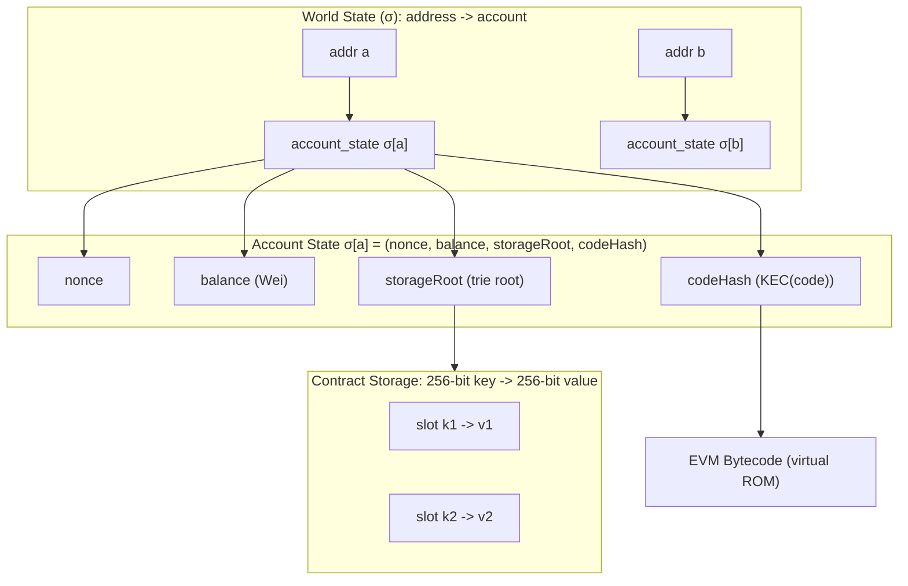

# EVM Architecture and the State of the World

`The Yellow Paper` defines the world state as a mapping from an address (160-bit identifier) ​​to an account state, and assumes that the client maintains this mapping using a `modified Merkle Patricia tree`; the account state consists of four fields: `nonce`, `balance`, `storageRoot`, and `codeHash`.

  - **nonce**: The outgoing transaction count for the EOA; for contract accounts, it's used for contract creation counts, etc.
  - **balance**: The balance denominated in Wei.
  - **storageRoot**: The trie root hash of the content stored in this account; both the key and value are 256-bit.
  - **codeHash**: The hash of the EVM code associated with this account (the code itself is stored elsewhere in the state database, indexed by hash).

EVM is a simple stack architecture. 
  - word size = 256 bits
  - address => word(256-bit)
  - stack's depth = 1024, but only last 9 variables are visible.(because opcode constraints)
  - NON-Von Neumann architecture: Code and data cannot be mixed.
  - Virtual Read-Only Memory: The code is stored in a logical "read-only area". ---Strong isolation

